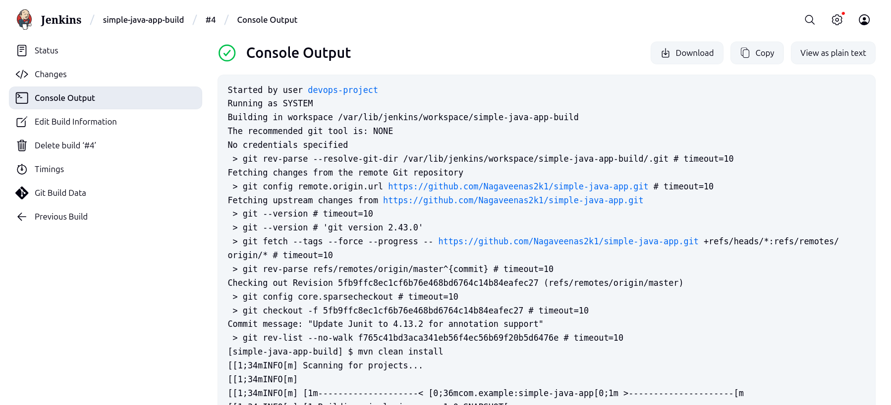
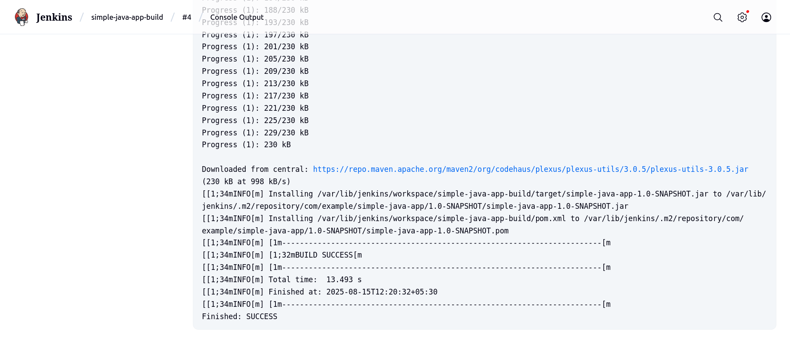
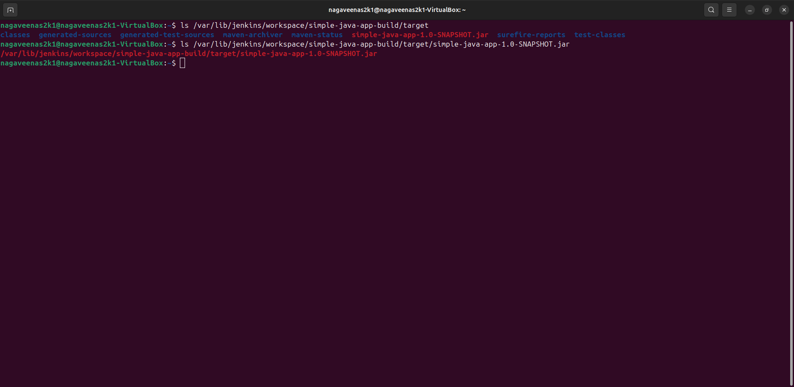

# Simple Java Maven Build with Jenkins

## Overview

This project is a basic Java application set up with Maven and built using Jenkins for Continuous Integration (CI).  
You will learn how to build, test, and automate a Java application using free, open-source tools.

---

## Folder Structure
```plaintext
simple-java-app/
├── pom.xml
├── README.md
└── src/
    ├── main/
    │   └── java/
    │       └── com/
    │           └── example/
    │               └── App.java
    └── test/
        └── java/
            └── com/
                └── example/
                    └── AppTest.java
```

---

## How to Build Locally
- Run the following command in your project directory:
 ```
  mvn clean install
  ```
This will produce a file like `target/simple-java-app-1.0-SNAPSHOT.jar`

---

## How to Access Jenkins

1. **Start Jenkins (if not already running)**
    ```
    sudo systemctl start jenkins
    ```

2. **Open Jenkins Web Interface**

  - In your web browser, go to:
    ```
    http://localhost:8080
    ```
    or use your server's IP address:
    ```
    http://<your-server-ip>:8080
    ```
  - Log in with your Jenkins username and password.

---

## How to Build in Jenkins

1. **Create a New Freestyle Job:**

- Go to Jenkins dashboard and click "New Item".
- Enter a job name (e.g., `simple-java-app-build`), select "Freestyle project", click OK.

2. **Configure Source Code Management:**

- Select "Git" and enter your repo URL (`https://github.com/your-username/simple-java-app.git`).

3. **Add the Build Step:**

- Scroll to "Build section", click "Add build step" and select "Invoke top-level Maven targets".
- In "Goals", enter:
  
  ```
  clean install
  ```

4. **Save and Build:**

- Click "Save" at the bottom.
- On your job page, click "Build Now".
- After build completes, check "Console Output" for details.

---

## How to Check Build Output

- Find the generated JAR file at:
```

/var/lib/jenkins/workspace/<your-job-name>/target/simple-java-app-1.0-SNAPSHOT.jar
```

---

## Screenshots

### Jenkins build success output

- Jenkins job configuration and build success:
- 
    
---

- 

---

### JAR file in Target

- JAR file present in `target/` folder:
- 

---

## Author

- S NAGAVEENA

